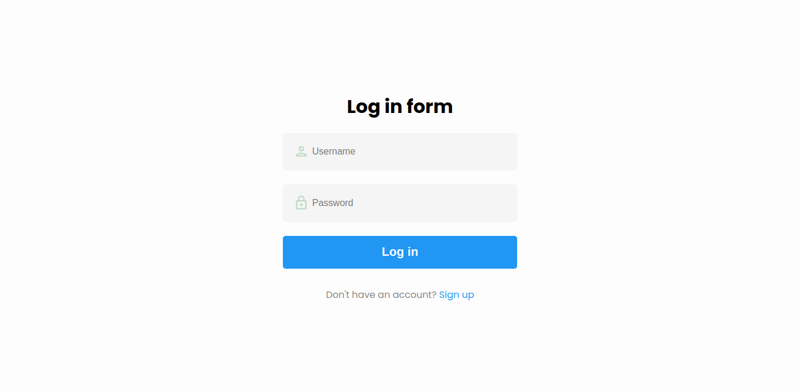
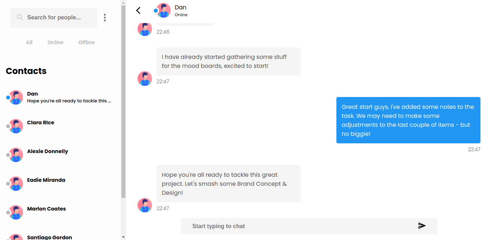

# Chat App

This project was built utilizing the MERN-Stack and other technologies.

## Main Technologies List

- Front-end: React.js
- Back-end: Node.js, Express.js.
- User Authentication: Passport.js, Passport-jwt, jsonwebtoken.
- Bata Base: MongoDB

## Screenshots

## Features

- Private Messaging.
- Messages are being requested in little chunks.
- JWT user authentication.
- Notification when a new message is received..
- Time when the message was sent.
- Filte user by, All, Offline, Online and by username.

### `Live`

Link: [Chat App](https://mern-stack-chat-app.vercel.app/)
